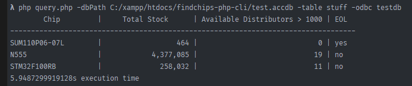

# Setup

```sh
git clone https://github.com/ljosberinn/findchips-php-cli/

cd findchips-php-cli
```

# Usage

## Parameters
```sh
-dbPath     absolute path to the database file
-table      table name within database
-odbc       arbitrary name you assigned
```

### Windows 10
- press Windows, type "odbc" and open 32-bit or 64-bit "ODBC Data Sources" depending on your machine
- tab User-DSN should be selected
- click "Add"
- on x64 machines, if you have only "SQL Server" available, download [this](https://www.microsoft.com/en-us/download/details.aspx?id=13255) package, install it, close and reopen "ODBC Data Sources" and click "Add" again, more options should be available now
- select, for the test.accdb provided, `Microsoft Access Driver (*.mdb, *.accdb)`
- on the next menu, select your database file and assign a name to it

- open a terminal
- execute `php query.php -dbPath <PATH_TO_YOUR_DB> -table <TABLE_NAME> -odbc <ASSIGNED_ODBC_NAME_FROM_BEFORE>`
- e.g. `php query.php -dbPath C:/xampp/htdocs/findchips-php-cli/test.accdb -table stuff -odbc testdb`

There should be plenty of errors to validate against whether you've done everything correctly.

Expected result for a sample set:


# Customization
Should be fairly easy, check the constants of Parser.php.

# Requirements
- PHP 7.1+
